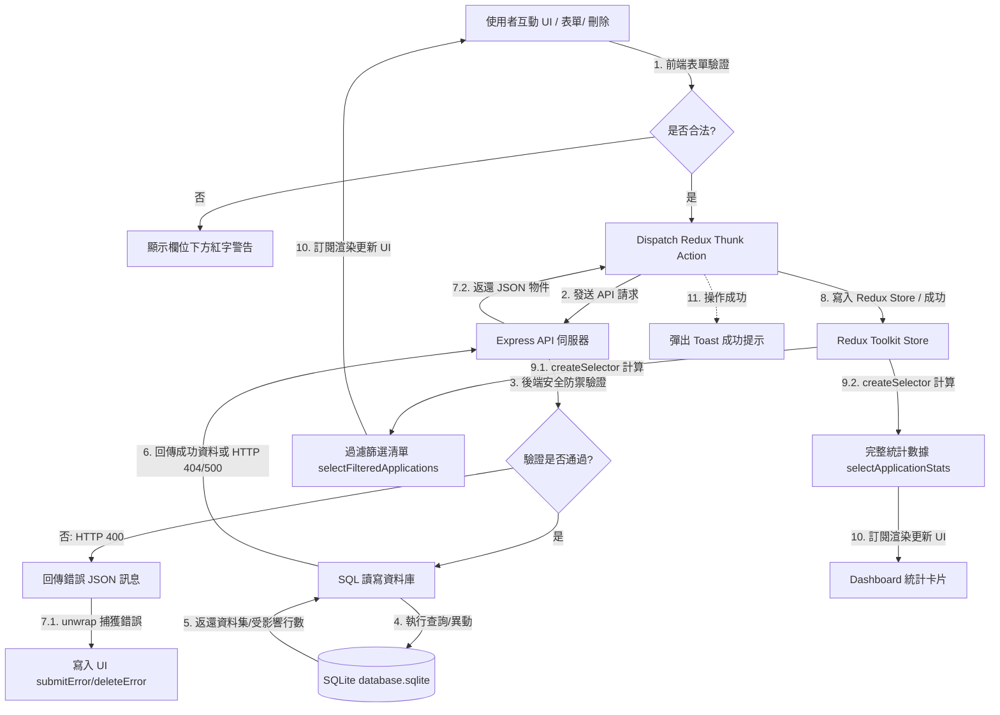

# 🎯 求職進度管理系統 (Job Application Tracker)

這是一個專為求職者設計的**全端求職進度管理系統**，旨在協助使用者高效率記錄、追蹤並管理所有應徵職缺的即時進度。系統具備美觀的 Dashboard 統計圖卡、強大的關鍵字與狀態複合篩選功能，並採用 SQLite 資料庫實現本機資料持久化儲存。

---

## 🎨 專案畫面截圖 (Screenshots)

*以下預留專案畫面截圖路徑以供作品集展示使用：*
* **桌機版主要介面與 Dashboard 統計**：``
* **新增／編輯客製化對話框 (Modal)**：``
* **行動版卡片佈局與適應性排版**：``

---

## ✨ 專案主要功能

1. **求職紀錄完整 CRUD**：支援使用者新增、檢視、編輯修改與刪除求職紀錄，且新增／編輯採用流暢的浮動 Modal 覆蓋層。
2. **多重複合條件篩選**：
   * **關鍵字搜尋**：針對「公司名稱 (companyName)」與「職缺名稱 (position)」進行忽略英文大小寫與首尾空格的即時過濾。
   * **狀態篩選**：支援依據全部、已投遞 (applied)、面試中 (interview)、Offer、未錄取 (rejected) 五大狀態進行下拉過濾。
   * **複合檢索**：關鍵字與狀態篩選可同時作用，且無任何資料時顯示友善的空狀態提示。
3. **Dashboard 統計卡片**：在清單上方直觀呈現「全部應徵數」、「已投遞」、「面試中」、「Offer」與「未錄取」的即時累計數值，不受篩選影響，固定依據資料庫完整資料統計，確保全貌一目了然。
4. **雙端嚴格表單驗證**：
   * **前端**：欄位未填或格式不合時直接於輸入框下方顯示紅色警告字，阻斷無效 API 發送；儲存進行中鎖定按鈕防止重複提交。
   * **後端**：對 `POST` 與 `PATCH` API 執行字串合法性與 YYYY-MM-DD 日期格式 Regex 防禦性校驗。
5. **高階 UI／UX 與錯誤處理**：
   * **自訂刪除確認 Modal**：淘汰瀏覽器原生的 alert/confirm，改用風格統一的高質感警告彈窗。
   * **API 失敗重試與 Toast**：GET 載入失敗時提供「🔄 重新載入」按鈕；CRUD 操作成功時彈出自動淡出的綠色 Success Toast。
6. **SQLite 資料持久化**：資料永久儲存在伺服器本機的 SQLite 資料庫檔案中，並具備初次啟動自動建表與防重複種子假資料填充機制。
7. **RWD 響應式佈局**：
   * **桌機版 (1280px)**：展示標準、資訊完整、具 Hover 反饋的資料表格與五欄並排的統計卡片。
   * **平板版 (768px)**：表格自動轉換為高質感的**獨立卡片清單**；Dashboard 卡片轉換為雙欄對齊。
   * **手機版 (375px)**：控制面板與表單完全垂直疊加，各點擊元件（按鈕、下拉選單）放大尺寸以利觸控操作，Modal 支援溢出捲動。

---

## 🛠️ 使用技術

### 前端 (Frontend)
* **React 19**：元件化架構建置 UI 介面。
* **TypeScript**：強化全端型別安全性與防錯。
* **Redux Toolkit**：使用 `createAsyncThunk` 異動非同步 API 狀態，並以 `createSelector` 設計高效、具快取快照（Memoized）的篩選與統計 Selectors。
* **Vanilla CSS**：無額外 CSS 框架，實現最高自由度與響應式動畫微調。

### 後端 (Backend)
* **Node.js & Express**：提供高效輕量且結構清晰的 RESTful APIs。
* **TypeScript**：編譯出型別安全的 Node.js 執行檔。
* **SQLite (sqlite3)**：輕量、零設定的本機關聯式資料庫。

---

## 🔄 前端與後端的資料流程

本系統的資料流主要採用 **Redux Toolkit 單向資料流** 搭配 **非同步 API 異動** 來驅動：



---

## 📁 專案資料夾結構

```text
JobApplicationTracker/
├── backend/                       # 後端伺服器
│   ├── src/
│   │   ├── config/
│   │   │   └── db.ts              # SQLite 資料庫初始化、建表、Seed 與 Promisified 封裝
│   │   ├── controllers/
│   │   │   └── applicationController.ts # 處理核心 CRUD 邏輯與雙端映射、防禦驗證
│   │   ├── middleware/            # 存放自訂中間件（例如錯誤處理）
│   │   ├── models/                # 資料模型與靜態 Mock 參考
│   │   ├── routes/                # 定義 API 路由路徑
│   │   ├── types/                 # 後端 TypeScript 型別定義
│   │   ├── app.ts                 # 註冊中介軟體、全域錯誤處理與路由
│   │   └── server.ts              # 伺服器啟動載入點
│   ├── database.sqlite            # 本地 SQLite 實體資料庫檔案 (已加至 .gitignore 避免上傳)
│   ├── package.json
│   └── tsconfig.json
│
├── frontend/                      # 前端 React 應用程式
│   ├── src/
│   │   ├── app/
│   │   │   ├── hooks.ts           # 經型別定義的 Redux Hooks
│   │   │   └── store.ts           # Redux 核心 Store 配置
│   │   ├── features/
│   │   │   └── applications/
│   │   │       └── applicationsSlice.ts # 管理求職資料、API Thunks、過濾與統計 Selectors
│   │   ├── types/
│   │   │   └── application.ts     # 前端求職型別聲明
│   │   ├── App.tsx                # 主要 UI 元件、Modal、RWD 標記與本地狀態
│   │   ├── App.css                # 核心設計系統、行動版轉換 Card 與微動畫
│   │   └── main.tsx               # 前端進入點
│   ├── package.json
│   └── tsconfig.json
│
└── .gitignore                     # 排除 node_modules、dist、.env、.sqlite 等暫存檔與本地庫
```

---

## ⚙️ 環境變數設定方式

在後端目錄 `backend/` 下可自行建立 `.env` 檔案以覆蓋預設設定：
```env
PORT=5000
NODE_ENV=development
```
*註：若未建立 `.env`，系統會預設使用 `PORT=5000` 並在 `development` 模式下執行。*

---

## 🔌 前後端使用的連接埠 (Ports)

| 應用層 | 連接埠 (Port) | 服務位址 | 備註 |
| :--- | :--- | :--- | :--- |
| **前端應用 (Frontend)** | `5173` | `http://localhost:5173` | 由 Vite Dev Server 開發伺服器託管 |
| **後端 API (Backend)** | `5000` | `http://localhost:5000` | 由 Express 伺服器託管 |

---

## 📖 API 路由說明

所有後端 API 以 `/api` 作為基礎路徑：

| 請求方法 (Method) | 路由路徑 (Route) | 功能說明 | 請求體規格 (Request Body) | 成功狀態碼 |
| :--- | :--- | :--- | :--- | :--- |
| **GET** | `/api/applications` | 獲取所有求職紀錄清單 | *無* | `200 OK` |
| **POST** | `/api/applications` | 新增單筆求職紀錄 | `{ companyName, position, status, appliedDate, note? }` | `201 Created` |
| **PATCH** | `/api/applications/:id` | 局部更新指定 ID 的求職紀錄 | `{ companyName?, position?, status?, appliedDate?, note? }` | `200 OK` |
| **DELETE** | `/api/applications/:id` | 刪除指定 ID 的求職紀錄 | *無* | `200 OK` |
| **GET** | `/api/health` | 後端伺服器健康度檢查 | *無* | `200 OK` |

---

## 🚀 本機安裝與啟動方式

請確保本機已安裝 **Node.js (建議 v18+)**。

### 1. 複製專案與安裝套件
打開終端機，執行以下指令：
```bash
# 複製專案
git clone https://github.com/JoeChou0810/job-application-tracker.git
cd JobApplicationTracker

# 安裝後端相依套件
cd backend
npm install

# 安裝前端相依套件
cd ../frontend
npm install
```

### 2. 開發模式啟動方式
建議使用雙視窗或終端機分頁分別啟動前後端：

* **啟動後端 API 伺服器**：
  ```bash
  cd backend
  npm run dev
  ```
  *(伺服器啟動後會自動初始化 `database.sqlite` 並注入 5 筆預設種子資料，運行於 `http://localhost:5000`)*

* **啟動前端 Vite 開發伺服器**：
  ```bash
  cd frontend
  npm run dev
  ```
  *(打開瀏覽器瀏覽 `http://localhost:5173` 即可檢視求職進度管理系統)*

### 3. 編譯與打包 (Build)
```bash
# 後端編譯 (將 TypeScript 編譯為 dist/ 內的 JS)
cd backend
npm run build

# 前端打包 (產生靜態資源於 dist/)
cd frontend
npm run build
```

---

## 🚀 已完成項目與未來可擴充功能

### 已完成項目
* [x] **Redux Toolkit 狀態管理** 與非同步 CRUD。
* [x] **SQLite 本地持久化資料庫** 與自動初始化填充。
* [x] **複合式關鍵字與進度狀態過濾** (使用 `createSelector` 優化)。
* [x] **Dashboard 統計看版圖卡**。
* [x] **前後端雙向防禦表單驗證**，顯示獨立欄位紅字提示。
* [x] **RWD 響應式佈局**，在小螢幕自動切換為卡片式排列，並配有高質感客製化 Modal 對話框。

### 未來可擴充功能
* **使用者註冊與登入驗證**：引入 JWT 或 OAuth，支援多使用者獨立管理各自的求職清單。
* **面試行事曆 (Calendar View)**：整合 Google Calendar，在 Dashboard 提醒即將到來的面試時程。
* **履歷與附件上傳**：允許使用者針對每筆應徵紀錄上傳 PDF 履歷或求職信 (Cover Letter) 檔案。
* **面試狀態歷史軌跡**：紀錄每筆求職從投遞到 Offer 的時間軸轉變軌跡，繪製求職漏斗分析圖。
